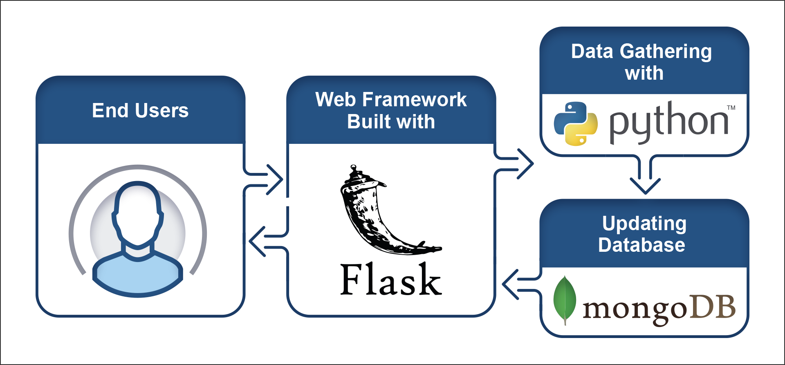
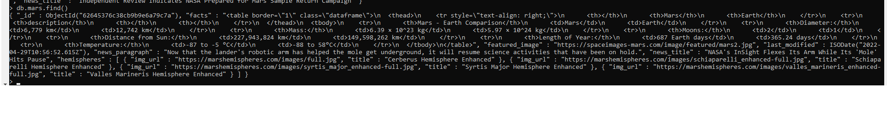
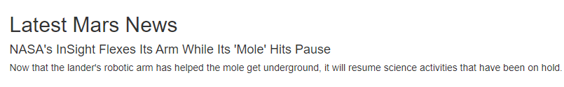
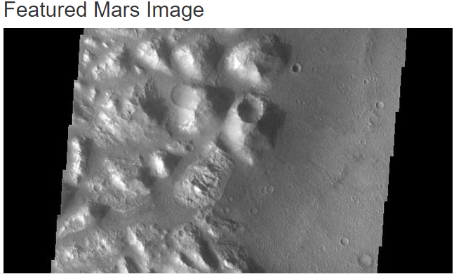
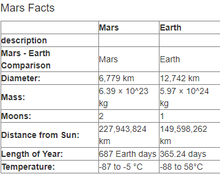
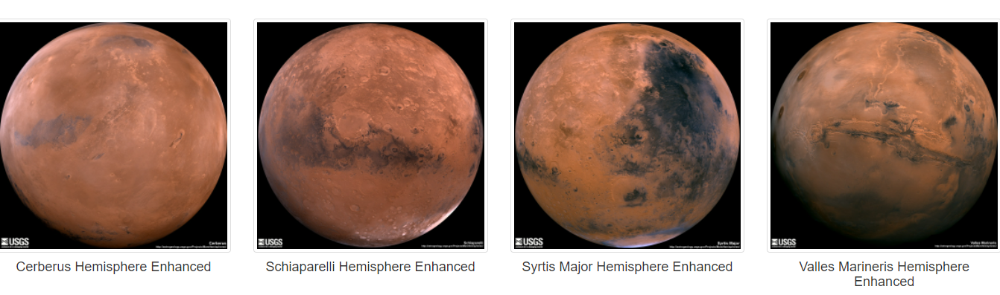

# Mission-to-Mars
In this project we will automate a web browser to visit different websites to extract data about the **Mission to Mars**. We'll store it in a NoSQL database, and then render the data in a web application created with Flask. The completed work will be displayed in the portfolio created by us.

## Table of Contents
- [Overview of Project](#OverviewProject)
- [Web Scraping](#web_scraping)
- [Store Data in NoSQL DB](#store_db)
- [Webpage](#webpage)
- [Flask](#flask)
- [Resources](#resources)
- [References](#references)

## Overview of Project
In this project we are performing webscraping, to scrape the latest news, facts and hemisphere images about Mars from the [Nasa website]('https://redplanetscience.com'). We store all this information in the **NoSQL database - Mongo DB** and render this information on a webpage created with Flask.

  
 

## Web Scraping

Web Scraping is a method used wordwide to extract online data for analysis. For this purpose we are using the following libraries:
1. Chrome Developer Tools - to identify HTML and CSS components which are used to build a webpage.
1. Splinter - to automate the web browser
2. Beautiful Soup - To identify the content for web scraping

[Link to the web scraping script](scraping.py)

## Store Data in NoSQL DB

After we scrape the required data from the NASA website, we are storing that information in Mongo DB. Mongo DB is a NoSQL database, which is used to store unstructured data in Json format. It does not hold any relationship with any other data in the database.
Below is a snapshot of the scraped data stored in the database:

  
 

## Webpage

We have created a [webpage](templates/index.html) using HTML, CSS and Bootstrap components to display the scraped data on the click of a button. This webpage displays the below information:
1. **Latest Mars News**

  
 

2.  **Featured Mars Image**

  
 

3.  **Mars Facts**

  
 

4.  **Images of Mars Hemispheres**

  
 

## Flask
Finally, we render the information on a webpage created with Flask. This python script imports the scraping script, and retrieves the required information from the NASA website, and displays it on the webpage created by us.
Here is the link to the python script : [app.py](app.py)

We are using **Jupyter notebooks, Python, Pandas,Regex** for cleaning and merging the dataset and then load the cleaned dataset into the SQL database - **PostgreSQL** for further analysis. 

##  Resources
[1] [mars nasa news site](https://redplanetscience.com)  
[2] [website to retrieve the featured image of Mars](https://spaceimages-mars.com)   
[3] [website to retrieve the facts table about Mars](https://galaxyfacts-mars.com)  
[4] [Website to retrieve the images of Mars Hemispheres](https://marshemispheres.com/)  

[5] Software: 
* Python 3.10.2
* Visual Studio Code 1.64.2
* MongoDB
* Flask
* Chrome

[6] Dependencies:
* Pandas
* Beautiful Soup
* Splinter
* Flask
* PyMongo

[6] Languages:
* HTML
* CSS
* BootStrap
* Python

##  References

https://getbootstrap.com/docs/3.3/examples/grid/ 
https://getbootstrap.com/docs/3.3/css/#images-responsive

